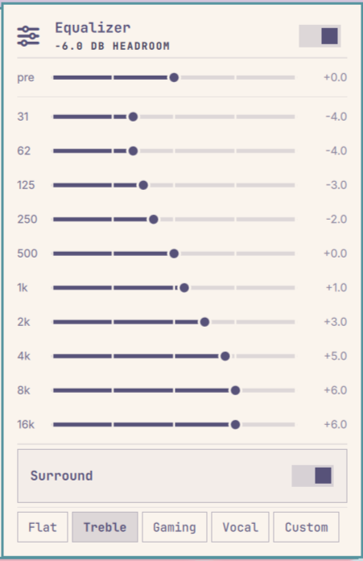

# Omarchy Equalizer

A 10-band graphic equalizer for [Omarchy](https://omarchy.org/): a PipeWire
filter-chain plus a bar widget of sliders.



- **No GUI application.** The DSP is a PipeWire filter-chain; the only interface
  is the Omarchy bar widget and a CLI. Nothing to theme, nothing extra running.
- **No external plugins.** Uses PipeWire's *builtin* `bq_peaking` biquads and a
  `linear` gain stage — no LV2, no LSP/Calf, nothing outside the base system.
- **Changes apply live.** Moving a slider updates the running filter in place;
  playback is never interrupted.
- **Automatic headroom.** The preamp is set to `-max(boost)` so a boosted curve
  cannot clip, with a manual offset available on top.
- **Surround toggle.** Mid/side stereo widening that flips live and leaves the
  bands and presets working normally.

## Requirements

PipeWire and `pw-cli` (both in the `pipewire` package), `python3`, and Omarchy's
shell. All three ship with Omarchy; nothing outside the official repositories is
used, and there are no LV2 or LADSPA plugin dependencies.

## Install

```bash
omarchy plugin add https://github.com/bitta-boo/omarchy-equalizer.git --enable
~/.config/omarchy/plugins/io.github.bitta-boo.equalizer/install.sh
```

The first command installs the bar widget. The second installs the DSP half —
the PipeWire filter host, the user service, and the `omarchy-eq` CLI — which is
what the widget actually drives.

Or from a clone, which does both in one step:

```bash
git clone https://github.com/bitta-boo/omarchy-equalizer.git
cd omarchy-equalizer && ./install.sh
```

Then select **Equalizer** as your audio output — it appears as a normal sink.
The filter does nothing until audio routes through it.

## Usage

Click the sliders icon in the bar. The panel gives you ten bands, a `pre`
(preamp) slider, a Surround toggle, and five preset buttons. The remaining
presets are available from the CLI.

- **Drag** a slider to change a band; it applies as you move.
- **Right-click** a slider to zero that band. Right-click `pre` to return it to
  fully automatic headroom.
- **Flat** clears the bands *and* the preamp.
- The header shows the resulting headroom, so the loudness trade-off is visible.
- The active preset is highlighted.
- **Custom** remembers whatever you dial in by hand. Editing any band writes
  into that slot, so you can switch to a preset and back and your own curve is
  still there. It persists across reboots.
- The toggle in the header bypasses the EQ without unloading it.

Everything is also available from the CLI:

```bash
omarchy-eq status              # current curve and service state
omarchy-eq set 4000 3          # one band, by centre frequency or index 0-9
omarchy-eq preamp 0            # manual offset; 0 = fully automatic
omarchy-eq preset custom       # flat | treble | bass-up | vocal | loudness | gaming | custom
omarchy-eq surround on | off   # stereo widening
omarchy-eq on | off
```

### Presets

| Preset | For |
|---|---|
| `flat` | neutral |
| `treble` | the conventional treble shape — lows pulled back, progressive lift from 2k up |
| `bass-up` | more weight |
| `vocal` | speech and podcasts — rumble and plosives cut, 250 Hz boxiness removed, presence lifted at 1–4k, top eased back so sibilance is not exaggerated |
| `loudness` | quiet listening (smile curve) |
| `gaming` | games and films — low-mids pulled back so effects don't mask speech, presence lift at 2–4k for dialogue and positional cues |
| `custom` | whatever you last dialled in by hand; editing any band writes into it |

## How it works

Each channel runs `linear` (preamp) → ten `bq_peaking` biquads at the ISO octave
centres 31 Hz–16 kHz, Q=1.41 → a shared mid/side widener.

The widener computes `mid = (L+R)/2`, `side = (L-R)/2` and outputs
`mid ± width·side`. At `width = 1.0` that reconstructs L and R exactly, so the
stage lives in the graph permanently and the Surround toggle is only a mixer
gain change — no rebuild, no dropout.

Surround costs no headroom. The widener only amplifies the *difference* between
the channels, so centred content passes at exactly unity and typical stereo
gains under 1 dB; only fully anti-phase material approaches the width factor,
which real recordings do not do at full scale. Reserving that worst case cost
4.1 dB on everything and was audible as a volume drop the moment you enabled it.
If very wide material ever clips, `pre` is the remedy.

The filter is hosted as its **own PipeWire client** under its own config name,
mirroring how Omarchy hosts its speaker tuning. That matters:

- restarting it does not drop every PulseAudio client's connection
- a malformed graph breaks only this service, not the audio daemon
- it does not share PipeWire's stock `filter-chain.conf.d` namespace, so it
  cannot pick up unrelated user filters

Gain changes are pushed into the running graph with `pw-cli set-param`, never by
restarting — restarting drops the sink, which makes players lose their stream.

The preamp sits at the **head** of the chain, because attenuating before the
biquads is what prevents clipping; a boosted band clips inside the filter
itself, where an output-side trim could not help.

State lives in `~/.config/omarchy/eq.json`. The bar widget shells out to
`omarchy-eq`, so the CLI remains usable on its own and a broken panel cannot
leave the audio graph in a bad state.

## Layout

```
manifest.json               plugin manifest (must be at the repo root)
Panel.qml                   the Omarchy bar widget
bin/omarchy-eq              CLI, graph generator, live updates
pipewire/omarchy-eq.conf    filter-chain host config
systemd/omarchy-eq.service  user service
```

`manifest.json` and `Panel.qml` live at the root because `omarchy plugin add`
clones the repository directly into `~/.config/omarchy/plugins/<id>/` and
validates the root. The rest installs to `~/.local/bin`, `~/.config/pipewire`
and `~/.config/systemd/user`.

`install.sh` notices when it is running from inside the plugins directory (the
`omarchy plugin add` case) and then installs only the DSP half.

## Uninstall

```bash
./uninstall.sh
```

Or, if it was installed with `omarchy plugin add`:

```bash
~/.config/omarchy/plugins/io.github.bitta-boo.equalizer/uninstall.sh
omarchy plugin remove io.github.bitta-boo.equalizer
```

Removes the user service, the PipeWire host config and generated graph, the
`omarchy-eq` CLI, and the bar widget. Your saved curve is left at
`~/.config/omarchy/eq.json`; delete it to forget it. Your audio output reverts
to the device the EQ was feeding.

## License

MIT — see [LICENSE](LICENSE).
